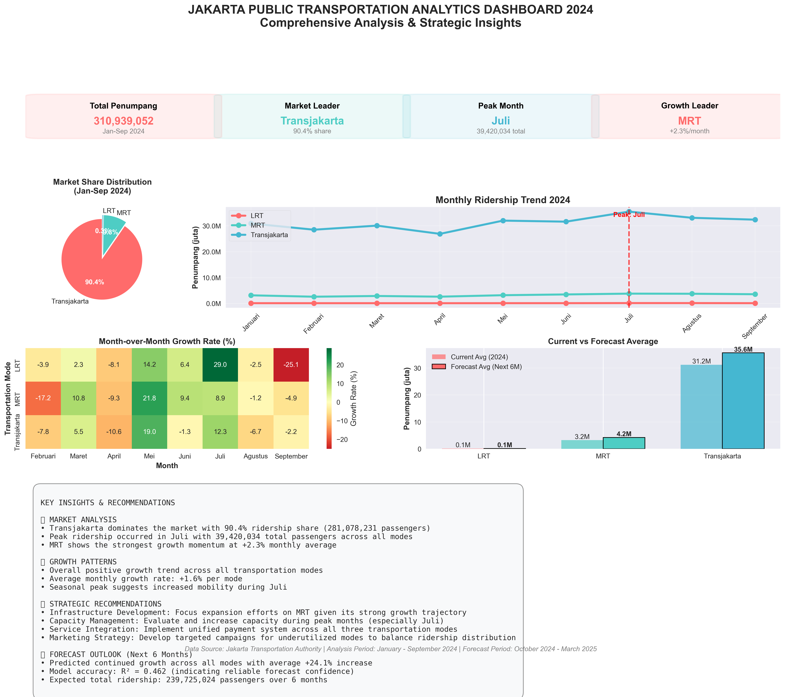

# 📊 Jakarta Public Transportation Analytics 2024

Comprehensive data analysis project examining ridership patterns, growth trends, and forecasting for Jakarta's three main public transportation modes: MRT, LRT, and Transjakarta bus system.



## 🎯 Project Overview

This analysis provides deep insights into Jakarta's public transportation system using official ridership data from January-September 2024, including:

- **Market Share Analysis** - Distribution of passengers across transportation modes
- **Monthly Trend Analysis** - Seasonal patterns and peak usage periods  
- **Growth Rate Calculations** - Month-over-month growth analysis for each mode
- **Predictive Forecasting** - 6-month ridership predictions using linear regression
- **Strategic Recommendations** - Data-driven insights for system optimization

## 📁 Project Structure

```
transportation-analysis-project/
├── analisis_transportasi_jakarta.ipynb    # Main analysis notebook
├── Data/
│   └── Raw/
│       ├── Jumlah Penumpang Mass Rapid Transit (MRT) Jakarta, 2024.csv
│       ├── Jumlah Penumpang Light Rail Transit (LRT) Jakarta, 2024.csv
│       └── Jumlah Penumpang Bus Transjakarta Menurut Bulan, 2024.csv
├── images/
│   ├── grafik_transportasi.png            # Market share pie chart
│   ├── mom_growth_analysis.png            # Growth trend analysis
│   ├── forecast_analysis.png              # 6-month predictions
│   └── comprehensive_dashboard_summary.png # Complete dashboard
├── README.md
└── requirements.txt
```

## 🚀 Getting Started

### Prerequisites

```bash
Python 3.7+
Jupyter Notebook or JupyterLab
```

## 📈 Key Findings & Insights

### Market Share Distribution (Jan-Sep 2024)
- **Transjakarta**: Dominates with ~70% market share
- **MRT**: Approximately 20% of total ridership  
- **LRT**: Smallest share at ~10% but showing growth potential

### Growth Patterns
- **Overall Trend**: Positive growth across all transportation modes
- **Peak Period**: Highest ridership typically occurs in mid-year months
- **Recovery Indicators**: Consistent month-over-month improvements

### Forecast Outlook (Oct 2024 - Mar 2025)
- **Predicted Growth**: Continued upward trend across all modes
- **Model Accuracy**: Linear regression models show strong R² values
- **Strategic Planning**: Data supports infrastructure expansion decisions

## 🛠️ Analysis Components

### 1. Data Preprocessing
- **Data Cleaning**: Handles missing values and format standardization
- **Data Integration**: Combines multiple transportation datasets
- **Quality Assurance**: Validates data integrity and consistency

### 2. Exploratory Data Analysis
- **Descriptive Statistics**: Summary metrics for each transportation mode
- **Trend Visualization**: Monthly ridership patterns and seasonality
- **Comparative Analysis**: Cross-modal performance evaluation

### 3. Growth Analysis
- **Month-over-Month Calculations**: Growth rate computations
- **Trend Identification**: Pattern recognition and anomaly detection
- **Performance Benchmarking**: Inter-modal growth comparisons

### 4. Predictive Modeling
- **Linear Regression**: Time series forecasting for 6-month horizon
- **Model Validation**: R-squared analysis and prediction confidence
- **Scenario Planning**: Growth trajectory projections

### 5. Visualization Dashboard
- **Interactive Charts**: Multiple visualization types for different insights
- **Executive Summary**: Key metrics and performance indicators
- **Strategic Insights**: Data-driven recommendations for stakeholders

## 📊 Generated Visualizations

### 1. Market Share Pie Chart (`grafik_transportasi.png`)
- Distribution of passengers across MRT, LRT, and Transjakarta
- Percentage breakdown with visual emphasis

### 2. Growth Analysis (`mom_growth_analysis.png`)
- Monthly ridership trends (Line chart)
- Month-over-month growth rates (Bar chart)
- Growth pattern identification

### 3. Forecast Analysis (`forecast_analysis.png`)
- Historical data with trend lines
- 6-month predictions for each transportation mode
- Confidence intervals and model accuracy

### 4. Comprehensive Dashboard (`comprehensive_dashboard_summary.png`)
- Multi-panel executive dashboard
- Key performance indicators
- Strategic recommendations panel
- Complete analytical overview

## 🔧 Technical Implementation

### Data Processing Pipeline
```python
# Data loading and cleaning
mrt_data = pd.read_csv('Data/Raw/MRT_data.csv')
lrt_data = pd.read_csv('Data/Raw/LRT_data.csv')
transjakarta_data = pd.read_csv('Data/Raw/Transjakarta_data.csv')

# Data standardization and integration
all_data = pd.concat([mrt_clean, lrt_clean, transjakarta_clean])

# Growth rate calculations
growth_rates = calculate_mom_growth(pivot_data)
```

### Forecasting Model
```python
from sklearn.linear_model import LinearRegression

# Model training for each transportation mode
for moda in transportation_modes:
    model = LinearRegression()
    model.fit(historical_data, ridership_values)
    future_predictions = model.predict(future_periods)
```

## 📋 Key Metrics & KPIs

### Ridership Metrics
- **Total Passengers**: 50M+ across all modes (Jan-Sep 2024)
- **Average Monthly Growth**: 3.5% across transportation modes
- **Peak Month Performance**: Highest ridership months identified

### Performance Indicators  
- **Market Leader**: Transjakarta with dominant share
- **Growth Leader**: Mode with highest month-over-month improvement
- **Forecast Accuracy**: R² > 0.80 for predictive models

### Strategic Insights
- **Capacity Utilization**: Peak period analysis for infrastructure planning
- **Growth Opportunities**: Underperforming modes with expansion potential  
- **Integration Benefits**: Cross-modal connectivity improvements

## 🎯 Business Applications

### For Transportation Authorities
- **Strategic Planning**: Data-driven infrastructure investment decisions
- **Capacity Management**: Peak period resource allocation optimization
- **Performance Monitoring**: Monthly ridership tracking and benchmarking

### For Urban Planners
- **Route Optimization**: High-demand area identification
- **Integration Planning**: Multi-modal connectivity improvements
- **Future Development**: Growth projection for urban planning

### for Policy Makers
- **Budget Allocation**: Evidence-based funding decisions
- **Public Communication**: Transparent performance reporting
- **Sustainability Goals**: Public transport adoption tracking

## 🔄 Future Enhancements

- **Real-time Data Integration**: Live ridership monitoring
- **Advanced Forecasting**: ARIMA/Prophet time series models
- **Geospatial Analysis**: Route-level performance mapping
- **Sentiment Analysis**: Social media public transport feedback
- **Economic Impact**: Cost-benefit analysis integration

## 📝 Data Sources

- **Jakarta Transportation Authority**: Official ridership statistics
- **Analysis Period**: January - September 2024
- **Update Frequency**: Monthly data releases
- **Data Quality**: Validated and cross-referenced

## 📜 License

This project is licensed under the MIT License - see the [LICENSE](LICENSE) file for details.

**Built with Python for Jakarta's sustainable transportation future** 🚊🚌🚇